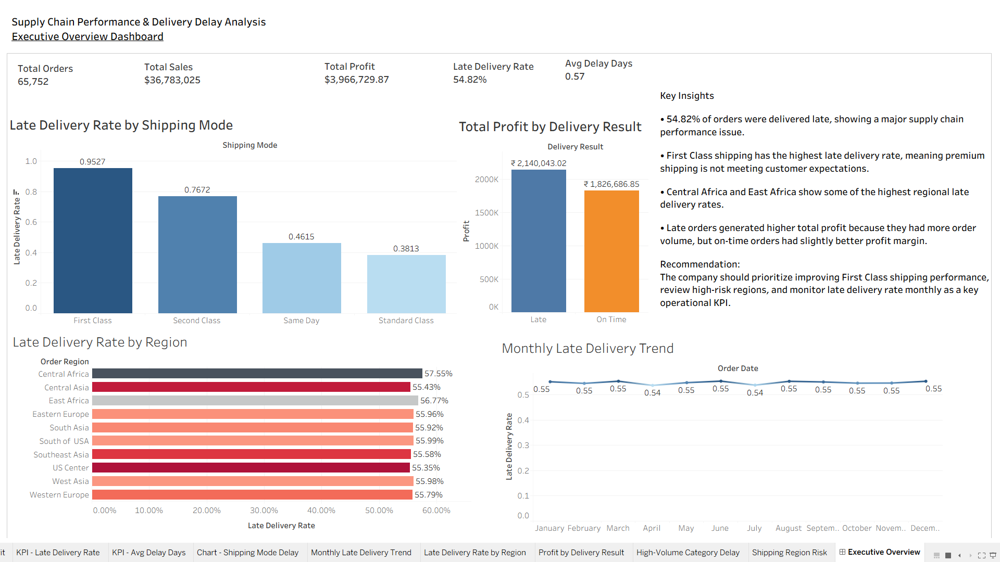

# Supply Chain Performance & Delivery Delay Analysis

## Project Overview

This project analyzes supply chain order data to identify delivery delay patterns, shipping performance issues, regional delivery risks, product category delays, and profit impact.

The goal of this project is to answer the business question:

**Which factors are causing delivery delays, how are delays affecting profit, and what actions can the company take to improve supply chain performance?**

This project uses **Python, SQL, and Tableau** to clean data, calculate business KPIs, analyze delay patterns, and build an executive dashboard for decision-making.

---

## Business Problem

Late deliveries can reduce customer satisfaction, damage customer trust, and create operational inefficiencies.

For a company handling thousands of orders, it is important to understand:

- Which shipping modes have the highest late delivery rate?
- Which regions are most affected by delivery delays?
- Which product categories create delivery risk?
- Are late deliveries affecting profit performance?
- Which shipping mode and region combinations should the business prioritize?
- How can the company reduce late deliveries and improve supply chain performance?

---

## Tools Used

- Python
- Pandas
- NumPy
- Matplotlib
- Jupyter Notebook
- SQL
- Tableau
- CSV files

---

## Dataset

The dataset used for this project is the **DataCo Smart Supply Chain dataset**.

The dataset contains order-level supply chain information, including:

- Order ID
- Order Date
- Shipping Date
- Shipping Mode
- Delivery Status
- Late Delivery Risk
- Order Region
- Product Category
- Customer Segment
- Sales
- Profit

---

## Project Workflow

1. Loaded the raw supply chain dataset
2. Selected relevant columns for business analysis
3. Renamed columns for easier use
4. Created new analysis columns:
   - `delay_days`
   - `delivery_result`
   - `delay_status`
   - `profit_margin`
   - `order_year`
   - `order_month`
   - `order_month_name`
5. Removed duplicate rows
6. Checked missing values and data quality
7. Saved a cleaned dataset
8. Performed analysis in Jupyter Notebook
9. Exported analysis-ready CSV files
10. Built an executive Tableau dashboard
11. Created business recommendations based on insights

---

## Data Cleaning Summary

The original dataset contained **180,519 rows and 53 columns**.

After selecting useful columns, removing duplicates, creating new features, and validating data quality, the final cleaned dataset contains:

|   Item         |  Value    |
|----------------|-----------|
| Cleaned Rows   | 180,511   |
| Cleaned Columns|   25      |
| Duplicate Rows |   0       |
| Missing Values |   0       |
| Unique Orders  | 65,752    |
| Date Range     | 2015-01-01 to 2018-01-31 |

```
The cleaned dataset was saved as:

data/cleaned/supply_chain_cleaned.csv
```


## Key Business Metrics

|    Metric          | Value   |
|--------------------|---------|
| Total Orders       | 65,752  |
| Late Orders        | 36,048  |
| Late Delivery Rate | 54.82%  |
| Total Sales        | $36.78M |
| Total Profit       | $3.97M  |
| Average Delay Days | 0.57    |

---

## Analysis Performed

### 1. Overall Supply Chain KPI Summary

The project first calculated the main supply chain KPIs, including total orders, late orders, late delivery rate, total sales, total profit, and average delay days.

The company had a 54.82% late delivery rate, meaning more than half of all orders were delivered late.

---

### 2. Late Delivery Rate by Shipping Mode

Shipping mode analysis showed that delivery performance varies strongly by shipping method.

| Shipping Mode | Late Delivery Rate |
|---------------|--------------------|
| First Class   |      95.27%        |
| Second Class  |      76.72%        |
| Same Day      |      46.15%        |
| Standard Class|     38.13%         |

**Key Insight:**  
First Class shipping had the highest late delivery rate at 95.27%, even though it is expected to be a faster shipping option.

This suggests a serious issue with premium shipping performance.

---

### 3. Late Delivery Rate by Region

Regional analysis showed that some locations have higher delivery delay risk than others.

Top high-risk regions included:

| Region         | Late Delivery Rate |
|----------------|--------------------|
| Central Africa |      57.55%        |
| East Africa    |      56.77%        |
| South of USA   |      55.99%        |
| West Asia      |      55.98%        |
| Eastern Europe |      55.96%        |

**Key Insight:**  
Delivery delays are not only caused by shipping method. Location also plays an important role in supply chain performance.

---

### 4. Profit Impact of Late Deliveries

Profit analysis compared late orders with on-time orders.

| Delivery Result | Total Orders | Total Profit | Avg Profit | Profit Margin |
|-----------------|--------------|--------------|------------|---------------|
| Late            | 36,048       | $2.14M       | $21.62     | 10.63%        |
| On Time         | 29,704       | $1.83M       | $22.40     | 10.97%        |

**Key Insight:**  
Late orders generated higher total profit because there were more late orders overall. However, on-time orders had slightly higher average profit and profit margin.

This suggests late deliveries may slightly reduce operational efficiency and profitability.

---

### 5. Late Delivery Rate by Product Category

Product category analysis identified which categories had high delivery delay risk.

After filtering for high-volume categories, important categories included:

- Cleats
- Electronics
- Accessories
- Golf Gloves
- Cameras

**Key Insight:**  
Cleats had a high late delivery rate and very high order volume, making it an important category for business review.

A strong analysis should not only look at high percentages. It should also consider order volume, because high-volume delayed categories affect more customers.

---

### 6. Shipping Mode and Region Risk Analysis

This analysis combined shipping mode and region to find the most risky delivery combinations.

Several of the highest-risk combinations involved **First Class shipping** across multiple regions.

Examples included:

| Shipping Mode | Region          | Late Delivery Rate |
|---------------|-----------------|--------------------|
| First Class   | North Africa    | 96.77% |
| First Class   | Southern Europe | 96.57% |
| First Class   | South Asia      | 96.32% |
| First Class   | West Asia       | 96.05% |

**Key Insight:**  
First Class delivery delays are not limited to one region. The issue appears across multiple regions, which suggests a broader operational problem with First Class shipping.

---

### 7. Monthly Late Delivery Trend

Monthly trend analysis was used to monitor how late delivery rate changed over time.

**Key Insight:**  
Tracking late delivery rate monthly helps the company monitor supply chain performance and detect operational problems early.

Late delivery rate should be treated as a monthly operational KPI.

---

## SQL Analysis

SQL can be used to validate and reproduce the main business KPIs from the cleaned dataset.

Example SQL questions answered in this project:

- What is the total number of orders?
- What is the overall late delivery rate?
- Which shipping mode has the highest late delivery rate?
- Which regions have the highest delay risk?
- How does profit compare between late and on-time orders?
- Which product categories should the business prioritize?

Example SQL query:

```sql
SELECT
    COUNT(DISTINCT order_id) AS total_orders,
    COUNT(DISTINCT CASE WHEN late_delivery_risk = 1 THEN order_id END) AS late_orders,
    ROUND(
        COUNT(DISTINCT CASE WHEN late_delivery_risk = 1 THEN order_id END) * 100.0
        / COUNT(DISTINCT order_id),
        2
    ) AS late_delivery_rate,
    ROUND(SUM(sales), 2) AS total_sales,
    ROUND(SUM(profit), 2) AS total_profit
FROM supply_chain_cleaned;
```

---

## Tableau Dashboard



The Tableau dashboard includes:

- Total Orders
- Total Sales
- Total Profit
- Late Delivery Rate
- Average Delay Days
- Late Delivery Rate by Shipping Mode
- Monthly Late Delivery Trend
- Late Delivery Rate by Region
- Profit by Delivery Result
- Key business recommendations

### Tableau Public Link
https://public.tableau.com/shared/GQFD4TDS3?:display_count=n&:origin=viz_share_link


## Business Recommendations

Based on the analysis, the company should:

1. **Review First Class shipping performance** because it has the highest late delivery rate at 95.27%.
2. **Investigate premium shipping promises** to check whether First Class delivery timelines are realistic.
3. **Focus on high-risk regions**, especially Central Africa and East Africa.
4. **Monitor late delivery rate monthly** as a key supply chain KPI.
5. **Review high-volume delayed categories**, especially categories like Cleats, Electronics, Accessories, and Golf Gloves.
6. **Compare carrier performance by region and shipping mode** to identify weak logistics partners.
7. **Improve fulfillment planning** for shipping mode and region combinations with late delivery rates above 95%.

---

## Project Files

Supply_Chain_Project
│
├── README.md
│
├── data
│   ├── raw
│   │   └── DataCoSupplyChainDataset.csv
│   │
│   └── cleaned
│       └── supply_chain_cleaned.csv
│
├── notebooks
│   └── supply_chain_delivery_delay_analysis.ipynb
│
├── sql
│   └── supply_chain_analysis_queries.sql
│
├── tableau
│   ├── data_for_tableau
│   ├── workbook
│   │   └── supply_chain_delivery_delay_dashboard.twbx
│   └── screenshots
│       └── executive_overview_dashboard.png
│
└── images
    └── executive_overview_dashboard.png


## What I Learned

This project helped me practice:

- Cleaning real-world supply chain data
- Creating business-focused KPIs
- Handling duplicate rows and missing values
- Creating new analysis features with Python
- Comparing performance by shipping mode, region, category, and time
- Measuring profit impact
- Building a Tableau executive dashboard
- Turning data analysis into business recommendations


## Conclusion

This project shows how supply chain data can be used to identify delivery delay problems, understand profit impact, and recommend operational improvements.

The analysis found that late deliveries are a major business issue, with 54.82% of orders delivered late. First Class shipping had the highest late delivery rate at 95.27%, and several regions also showed high delay risk.

By improving First Class shipping performance, reviewing high-risk regions, monitoring monthly late delivery rate, and focusing on high-volume delayed categories, the company can improve customer satisfaction and supply chain efficiency.
